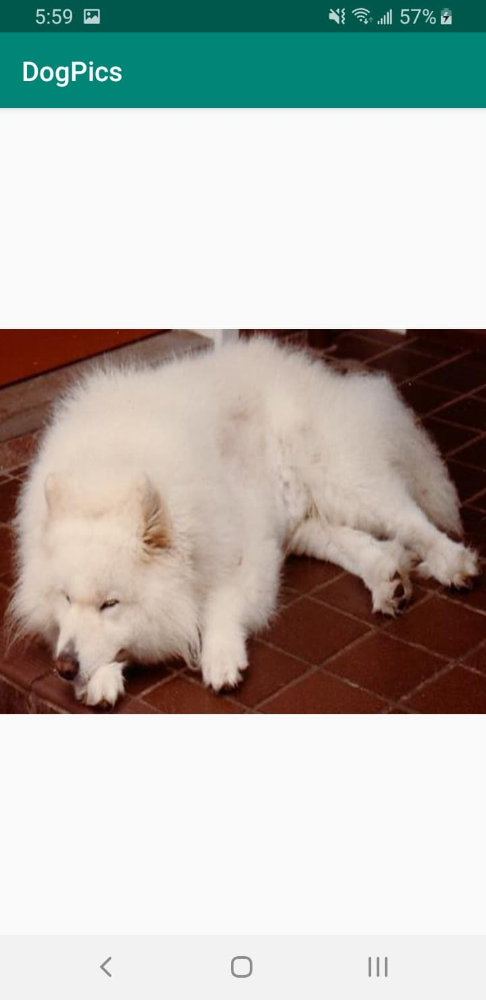

# DogPics

App for dog-lovers to look up pictures of dogs. Users can search for random dog pictures or pictures by breeds and sub-breeds.

App makes Api calls to <a href=https://dog.ceo/dog-api/>DogApi</a> to retrieve the Image URLs and dog breed information.

Api calls are made using the <a href=https://square.github.io/retrofit/>Retrofit</a> library and images are retrieved from the URLs and
placed on the screen using the <a href=https://square.github.io/picasso/>Picasso</a> library.

# Screenshots - After UI Update

**Home Screen** 

  

**Image Screen** 

  

**Info Filled**

  

**Spell Check**

  

**No Internet**

  

# Screenshots - Before UI Update

**Home Screen** 

  

**Image Screen** 

  

**Info Filled**

  

